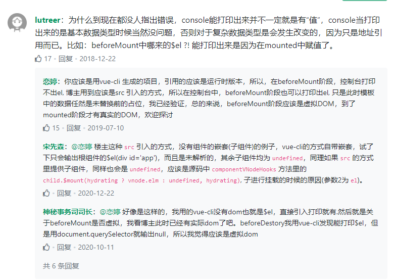
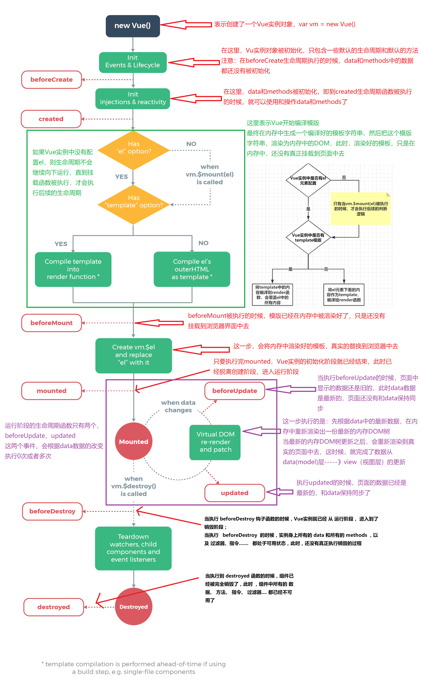

# Vue 学习笔记

### Vue版本
+ 目前我一直在使用的都是Vue2，只不过脚手架用的是VueCLI3，所以会有vue.config.js文件，VueCLI2是比较繁杂的一个结构
+ Vue3目前已经发布，其特性开始向React靠近，并且书写格式与2完全不同，后期需要从项目一开始就完成更新

### Vue 生命周期
+ new Vue()
	> 创建一个Vue的实例对象，进入组件的创建阶段 
+ Init Events & Lifecycle
	> 初始化组件的事件和生命周期函数，当执行完这一步骤，组件的生命周期的钩子函数就已经全部初始化好了，等着依次调用
+ beforeCreate
	> 此时组件的data和methods以及页面DOM结构，都还没有初始化
+ created
	> 此时组件的data和methods已经初始化完成，但是DOM结构依然没有完成初始化，一般在这个阶段我们会发起数据请求
+ beforeMount
	> + 此时模板已经在内存中完成编译，但是还没有真正渲染到页面上，此时页面上看不到真实数据，此时用户看到的还是一个模板页面，就是带有花括号的初始代码，存在虚拟DOM  
	> + 在此之后内存中的模板结构正在被替换到页面上
+ mounted
	> + 这是组件创建阶段的最后一个生命周期函数，此时页面已经真正完成渲染，DOM结构完成初始化，用户可以看到页面上真实的数据  
	> + 当这个生命周期的钩子函数执行完，组件就离开了创建阶段，进入到运行阶段  
	> + 如果大家用到一些第三方的UI插件，而这个插件需要被初始化，那么，也必须在mounted中来初始化  
+ beforeUpdate
	> + 此时组件进入运行阶段
	> + 会根据data数据的变化，有选择性的触发0次或N次
	> + 此时数据已经是最新的，但是页面呈现的数据还是旧数据
	> + 在此之后页面会根据最新的data，重新渲染内存中的模板结构，并把页面中的模板结构重新渲染到页面上
+ updated
	> 此时页面已经完成了更新，data数据是最新的，页面上呈现的数据也是最新的
+ beforeDestroy
	> 此时组件即将被销毁，但是还没开始，组件还是正常可用的，data和methods等都还是可以正常访问的
+ destroyed
	> 此时组件已经完成销毁，data和methods已经都不可用了

### Vue 生命周期流程图
<!--  -->
<!-- 注意在图片地址后面必须加一个空格否则图片会无法加载 -->


### Vue 生命周期打印演示
```
	var vm = new Vue({
		el: '#app',
		data: {
			message: 'Vue的生命周期'
		},
		beforeCreate: function() {
			console.group('------beforeCreate创建前状态------');
			console.log("%c%s", "color:red" , "el     : " + this.$el); //undefined
			console.log("%c%s", "color:red","data   : " + this.$data); //undefined 
			console.log("%c%s", "color:red","message: " + this.message) 
		},
		created: function() {
			console.group('------created创建完毕状态------');
			console.log("%c%s", "color:red","el     : " + this.$el); //undefined
			console.log("%c%s", "color:red","data   : " + this.$data); //已被初始化 
			console.log("%c%s", "color:red","message: " + this.message); //已被初始化
		},
		beforeMount: function() {
			console.group('------beforeMount挂载前状态------');
			console.log("%c%s", "color:red","el     : " + (this.$el)); //已被初始化
			console.log(this.$el);
			console.log("%c%s", "color:red","data   : " + this.$data); //已被初始化  
			console.log("%c%s", "color:red","message: " + this.message); //已被初始化  
		},
		mounted: function() {
			console.group('------mounted 挂载结束状态------');
			console.log("%c%s", "color:red","el     : " + this.$el); //已被初始化
			console.log(this.$el);    
			console.log("%c%s", "color:red","data   : " + this.$data); //已被初始化
			console.log("%c%s", "color:red","message: " + this.message); //已被初始化 
		},
		beforeUpdate: function () {
			console.group('beforeUpdate 更新前状态===============》');
			console.log("%c%s", "color:red","el     : " + this.$el);
			console.log(this.$el);   
			console.log("%c%s", "color:red","data   : " + this.$data); 
			console.log("%c%s", "color:red","message: " + this.message); 
		},
		updated: function () {
			console.group('updated 更新完成状态===============》');
			console.log("%c%s", "color:red","el     : " + this.$el);
			console.log(this.$el); 
			console.log("%c%s", "color:red","data   : " + this.$data); 
			console.log("%c%s", "color:red","message: " + this.message); 
		},
		beforeDestroy: function () {
			console.group('beforeDestroy 销毁前状态===============》');
			console.log("%c%s", "color:red","el     : " + this.$el);
			console.log(this.$el);    
			console.log("%c%s", "color:red","data   : " + this.$data); 
			console.log("%c%s", "color:red","message: " + this.message); 
		},
		destroyed: function () {
			console.group('destroyed 销毁完成状态===============》');
			console.log("%c%s", "color:red","el     : " + this.$el);
			console.log(this.$el);  
			console.log("%c%s", "color:red","data   : " + this.$data); 
			console.log("%c%s", "color:red","message: " + this.message)
		}
	})
```


### Vue 生命周期流程图
<!--  -->
<!-- 注意在图片地址后面必须加一个空格否则图片会无法加载 -->


### Vue 如何手撸一个生命周期的钩子函数？
（总不能一直做一个API调用者吧）